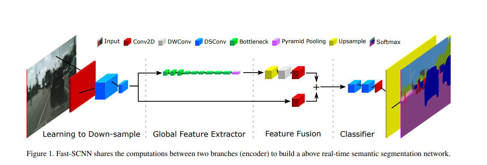

# Fast SCNN Implementation

  

Fast SCNN implementation on Potsdam and UDD dataset.  
Simple implementation for custom dataset training.  
paper: https://arxiv.org/abs/1902.04502  
dataset: http://www2.isprs.org/commissions/comm3/wg4/2d-sem-label-potsdam.html  

